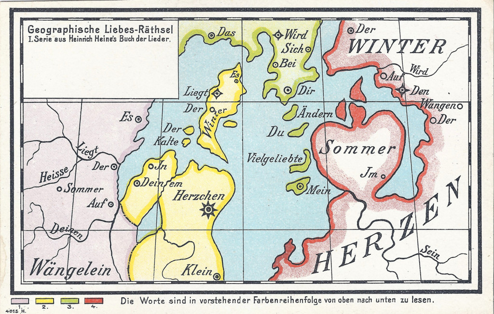

#Maptime #8 Literary Maps

This Maptime will all be about literary maps! A literature map, or literary map is the mapping of literature based on its geographic connections and associations. After hearing the presentations of Yolanda and Marleen, we will hopefully be inspired to make our own literary maps! 

##Assignment
With your favourite poem, or book, we will make a postcard map: or cartographic riddle. Based on the postcards from Menno, Geographische Liebes-Räthsel. See http://denengelse.nl/blogt/geographische-liebes-rathsel/ 

Postcard sized paper will be provided, to draw your map on. The text will be hidden in the map, by placing the words of your poem or quote as place marks in the map.
Your map can be either a fantasy map or based on a map that is relevant to you or your text.

Shape files can be exported to inkscape to place the text in there or printed to be edited by hand. 

Also you can draw the cards by hand or use your computer to make the different elements of your postcard. Markers and pens are provided. 

The following links contain tutorials which might be helpfull:

##QGIS tutorials
- https://github.com/maptime/portland/blob/gh-pages/tutorials/Cartographic-Design-Notes-and-Resources-by-Alexa-Todd.md

##Inkscape text tutorials
- http://goinkscape.com/how-to-curve-text-in-inkscape/ 
- http://design.tutsplus.com/tutorials/kerning-spacing-and-other-text-tricks-in-inkscape--cms-20576
- pdf

##Drawing Maps by hand tutorials
- http://worldbuildingschool.com/the-authors-guide-to-drawing-maps/
- http://www.fantasticmaps.com/2015/02/how-to-draw-a-map/ 
- http://www.fantasticmaps.com/category/tips-and-tricks/ 
- http://fantasy-maps.com/tutorials/

##Photoshop map tutorial
- http://worldbuildingschool.com/the-authors-guide-to-drawing-maps/

##Inspiration:
- http://now-here-this.timeout.com/2013/12/11/11-hand-drawn-maps-to-adorn-any-london-lovers-wall/ 
- http://www.buzzfeed.com/danieldalton/map-of-literature#.nbxD81nVPA
- http://ebookfriendly.com/literary-maps-to-explore/
- www.leesbaaramsterdam.nl
- www.mapsandthecity.com
- http://denengelse.nl/blogt/geographische-liebes-rathsel/ 